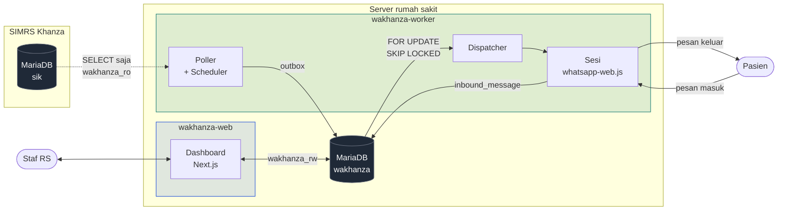

# wakhanza

**Gateway notifikasi WhatsApp untuk SIMRS Khanza.** Membaca kejadian dari database rumah sakit secara *read-only* — pasien dapat nomor antrian, booking dikonfirmasi, hasil lab siap, obat siap diambil, tagihan terbit — lalu mengirimkan pemberitahuannya lewat WhatsApp.

Dipasang **on-premise** di server rumah sakit. Satu rumah sakit, satu nomor WhatsApp.

> **Nol perubahan pada SIMRS Khanza adalah sasaran desain nomor satu.** Sistem ini tidak pernah menulis satu baris pun ke database Khanza, dan itu ditegakkan oleh hak akses MariaDB — bukan oleh disiplin kode. Worker menolak menyala kalau ternyata ia bisa menulis.

---

## Daftar isi

- [Untuk siapa ini](#untuk-siapa-ini)
- [Yang dikerjakan, dan yang sengaja tidak](#yang-dikerjakan-dan-yang-sengaja-tidak)
- [Arsitektur](#arsitektur)
- [Kelas pemicu](#kelas-pemicu)
- [Dashboard](#dashboard)
- [Persyaratan](#persyaratan)
- [Pemasangan](#pemasangan)
- [Perintah](#perintah)
- [Struktur proyek](#struktur-proyek)
- [Privasi dan keamanan](#privasi-dan-keamanan)
- [Pengujian dan verifikasi](#pengujian-dan-verifikasi)
- [Menjalankan di produksi](#menjalankan-di-produksi)
- [Cadangan](#cadangan)
- [Status proyek](#status-proyek)
- [Peta dokumen](#peta-dokumen)
- [Yang sengaja ditolak](#yang-sengaja-ditolak)

---

## Untuk siapa ini

Rumah sakit yang **sudah** memakai SIMRS Khanza dan ingin pasiennya menerima pemberitahuan WhatsApp tanpa mengubah apa pun di SIMRS-nya.

Bukan produk SaaS, bukan multi-tenant, dan bukan vendor WhatsApp pihak ketiga. Ia berjalan di server rumah sakit sendiri, memakai nomor WhatsApp rumah sakit sendiri, dan datanya tidak pernah keluar dari mesin itu kecuali sebagai pesan WhatsApp ke pasien yang bersangkutan.

## Yang dikerjakan, dan yang sengaja tidak

**Dikerjakan**

- Sepuluh kelas pemicu — tujuh reaktif dari kejadian di Khanza, plus broadcast, broadcast terjadwal, balasan otomatis, notifikasi farmasi, dan balasan stok/harga obat
- Dashboard 16 halaman: antrean pesan, log pengiriman, koneksi WhatsApp, template, broadcast, daftar tolak, nomor bermasalah, audit, pengguna, dan seterusnya
- Autentikasi berbasis peran (admin / operator), sesi terkunci setelah 5 kegagalan login
- Jam tenang, kuota per jam, jeda acak antar kirim, kode unik per pesan — semuanya untuk menghindari nomor rumah sakit terbaca sebagai spam
- Daftar tolak (opt-out) yang cakupannya sengaja sempit dan dinyatakan di depan pasien
- Cadangan harian terenkripsi AES-256 (database + sesi WhatsApp), terjadwal lewat Task Scheduler

**Sengaja TIDAK dikerjakan**

- Menulis ke database Khanza — sama sekali, dalam keadaan apa pun
- Mengambil nama pemeriksaan lab, nama obat, hasil, atau diagnosis dari database pasien. Kolomnya tidak pernah masuk klausa `SELECT`, bukan diambil lalu disaring saat render
- Percakapan dua arah yang bebas. Balasan otomatis hanya mencocokkan **kata kunci** dan isinya ditulis staf — tidak ada model bahasa yang menafsirkan keluhan pasien
- Multi rumah sakit, multi nomor, atau antarmuka publik

## Arsitektur

Dua proses yang **tidak pernah berbicara lewat HTTP**. Seluruh koordinasi lewat tabel di database `wakhanza`.



**Dua koneksi database, dua tingkat kepercayaan.**

| Koneksi | Pengguna MySQL | Hak | Kenapa |
|---|---|---|---|
| `sik` | `wakhanza_ro` | `SELECT` saja, `pool.max: 2` | Tidak boleh menulis, dan tidak boleh berebut koneksi dengan SIMRS yang sedang dipakai petugas |
| `wakhanza` | `wakhanza_rw` | `INSERT` skema-lebar; `UPDATE`/`DELETE` **per tabel** | `audit_log` dikecualikan selamanya — append-only ditegakkan hak akses, bukan kode |

Worker **wajib** mencoba `CREATE TEMPORARY TABLE` di `sik` saat mulai dan berhenti jalan bila berhasil. Diperiksa ulang kapan saja lewat `npm run verify:db`.

**Pipeline bersama.** Setiap pemicu melewati jalur yang sama persis (`src/worker/pipeline.ts`):

```
POLL → COALESCE → RESOLVE nomor → NORMALIZE → GATE (opt-out/invalid) → PRIVACY → RENDER → ENQUEUE
                                                                                              ↓
                                                                     DISPATCH → SEND → LOG (dispatcher.ts)
```

Enqueue terpisah total dari kirim: kegagalan kirim tidak pernah menghapus jejak bahwa pemicunya terdeteksi.

## Kelas pemicu

| Kelas | Pemicu | Berangkat dari | Tunduk daftar tolak | Jam tenang |
|---|---|---|---|---|
| **Sisip** (watermark) | `QUEUE_REG`, `RESULT_READY`, `PHARMACY_READY`, `BILLING_READY`, `BOOK_CONFIRM` | Kejadian di `sik` | Ya | Ya |
| **Pindai** (jendela) | `BOOK_CANCEL`, `BOOK_REMIND` | Kejadian di `sik` | Ya | `BOOK_CANCEL` lewat |
| **Broadcast** | `BROADCAST` | Staf menekan kirim | Tidak | Ya |
| **Broadcast terjadwal** | `BROADCAST` | Worker, saat jadwal jatuh tempo | Tidak | Ya |
| **Balasan otomatis** | `AUTO_REPLY` | **Pesan masuk pasien** | Tidak | Lewat |
| **Notifikasi farmasi** | `FARMASI_*` | Kejadian di `sik` | Tidak berlaku | Lewat |

Tiga pengecualian daftar tolak itu bukan kelalaian dan didaftarkan secara sadar di `src/core/optOut.ts`:

- **Broadcast** adalah pengumuman yang disusun staf — kanal berbeda dari notifikasi kunjungan.
- **Balasan otomatis** menjawab pesan yang pasiennya sendiri kirim barusan. Mendiamkan orang yang baru saja bertanya bukan menghormati permintaannya, melainkan membuat sistem tampak rusak.
- **Notifikasi farmasi** tidak menuju nomor pasien mana pun; seorang pasien tidak bisa memberhentikan koordinasi kerja internal rumah sakit.

Kode pemicu yang tidak terdaftar dianggap **tidak terikat** — pemicu baru harus didaftarkan sadar-sadar, karena default "terikat" akan membuat kanal baru diam-diam berhenti terkirim tanpa ada yang memutuskan.

**Sakelar yang default MATI** dan harus dinyalakan rumah sakit sendiri: `autoreply.enabled`, `farmasi.enabled`, `farmasi.stok_mode`. Ketiganya menuntut keputusan kebijakan lebih dulu — lihat [RUNBOOK.md §9](RUNBOOK.md).

## Dashboard

| Halaman | Peran | Isi |
|---|---|---|
| `/ringkasan` | semua | Halaman pendaratan: KPI hari ini, grafik volume, status sistem, kesehatan arah masuk |
| `/antrean` | semua | Pesan yang menunggu/terkirim/gagal, dengan pencarian no. RM · nomor WA · kode pengiriman |
| `/log` | semua | Setiap percobaan kirim, termasuk yang gagal lalu dicoba ulang |
| `/koneksi` | semua | Status sesi WhatsApp, QR untuk menautkan |
| `/pesan-masuk` | admin | Pesan yang diterima nomor RS + ID pengirim/grup yang bisa disalin |
| `/template` | admin sunting | Tujuh template pemicu + template broadcast + tujuan tambahan per pemicu |
| `/broadcast` | admin | Kirim pesan ad-hoc ke segmen pasien terpilih |
| `/broadcast-terjadwal` | admin | Simpan segmen + pesan + pola pengulangan; worker yang mengeksekusi |
| `/balasan-otomatis` | admin | Aturan kata kunci, kotak uji coba, ringkasan pemakaian |
| `/farmasi` | admin | Notifikasi ke grup apotek + balasan stok/harga obat |
| `/daftar-tolak` | semua (hapus: admin) | Nomor yang meminta berhenti |
| `/nomor-bermasalah` | semua | Nomor pasien yang gagal dinormalkan, untuk dikoreksi manual |
| `/pengaturan` | admin sunting | Jam tenang, interval polling, identitas RS, poli sensitif, webhook peringatan |
| `/pengguna` | admin | Akun dashboard |
| `/profil` | semua | Ganti nama dan kata sandi sendiri |
| `/audit` | admin | Riwayat tindakan petugas — tidak bisa dihapus atau diubah |

"admin sunting" berarti operator boleh melihat halamannya tapi tidak mengubah apa pun — penolakannya di server, bukan sekadar tombol yang disembunyikan.

Otorisasi ditegakkan **dua lapis**, dan keduanya perlu diperiksa saat menambah route baru:

- `src/proxy.ts` menjaga HALAMAN saja (redirect ke `/login`). `/api/*` sengaja **dikecualikan** dari matcher-nya — kalau tidak, pemanggil API menerima redirect HTML alih-alih JSON.
- Setiap route di `src/app/api/**/route.ts` memanggil `requireSession()`/`requireRole('admin')` dari `src/lib/authz.ts` **sendiri** lalu mengembalikan 401/403 JSON.

Halaman admin-only juga memeriksa perannya di server dan mengarahkan operator ke `/ringkasan` — nav memang menyembunyikan tautannya, tapi itu UI saja dan akses langsung lewat URL harus tetap ditolak.

## Persyaratan

| | Versi | Catatan |
|---|---|---|
| Node.js | 22 LTS | Memakai `process.loadEnvFile()` |
| MariaDB | 10.4 | Versi yang dipakai SIMRS Khanza. **Bukan** MySQL 8 — tanpa CTE rekursif yang baik, tanpa `JSON_TABLE` |
| Chromium | otomatis | Ditarik Puppeteer lewat `whatsapp-web.js` |
| OS | Windows Server / Windows 11 | Skrip pendukung berbentuk PowerShell; kode aplikasinya sendiri lintas platform |
| PM2 | terbaru | Manajemen proses produksi |

Ditambah: satu nomor WhatsApp khusus untuk rumah sakit (jangan nomor pribadi petugas), dan akses `mysql` dengan hak `GRANT` untuk pemasangan awal.

## Pemasangan

### 1. Dependensi dan berkas lingkungan

```bash
git clone <repo-url> wakhanza
cd wakhanza
npm ci
cp .env.example .env
```

Isi `.env` — seluruh variabelnya beserta keterangannya ada di `.env.example`. **`.env` tidak pernah masuk git** dan berisi kredensial database beserta rahasia sesi.

Rahasia sesi dashboard bisa dibuat dengan:

```bash
node -e "console.log(require('crypto').randomBytes(32).toString('base64'))"
```

### 2. Pengguna database

Dua pengguna MySQL, dan pemisahannya bukan formalitas. Jalankan sebagai `root`:

```sql
-- Pembaca Khanza: SELECT saja, tidak pernah lebih
CREATE USER 'wakhanza_ro'@'localhost' IDENTIFIED BY '<sandi-kuat>';
GRANT SELECT ON sik.* TO 'wakhanza_ro'@'localhost';

-- Pemilik skema wakhanza
CREATE DATABASE wakhanza CHARACTER SET utf8mb4 COLLATE utf8mb4_unicode_ci;
CREATE USER 'wakhanza_rw'@'localhost' IDENTIFIED BY '<sandi-kuat>';
GRANT SELECT, INSERT, CREATE, ALTER, INDEX, DROP, REFERENCES ON wakhanza.* TO 'wakhanza_rw'@'localhost';
```

`UPDATE` dan `DELETE` **sengaja tidak diberikan di tingkat database**, lalu diberikan satu per satu di tingkat tabel — dengan `audit_log` dikecualikan selamanya. Daftar tabel yang membutuhkannya ada di [TECH_STACK.md](TECH_STACK.md).

> **Jebakan yang nyata, ditemukan saat implementasi:** MariaDB menyatukan hak akses lintas tingkatan, jadi `REVOKE DELETE, UPDATE ON audit_log` di atas fondasi `GRANT ALL` **tidak menegakkan apa pun**. Ini bukan teori — lihat [ARCHITECTURE.md §9.5](ARCHITECTURE.md). Setiap tabel baru butuh grant eksplisit; tidak ada yang diwarisi.

### 3. Skema dan verifikasi

```bash
npm run migrate       # menerapkan migrations/*.sql yang belum jalan
npm run verify:db     # membuktikan sik menolak tulisan, dan audit_log append-only tertegak
npm run verify:plans  # EXPLAIN tiap query poller
```

Ketiganya harus lolos sebelum lanjut. `verify:db` dan `verify:plans` bukan pemeriksaan opsional — keduanya menegakkan dua batasan yang paling gampang dilanggar tanpa sadar: menulis ke `sik`, dan query yang diam-diam berubah dari index seek jadi full table scan.

### 4. Akun admin pertama

```bash
npm run seed:admin -- <username> "<Nama Lengkap>" <sandi>
```

### 5. Pindai nomor pasien di muka

```bash
npm run scan:contacts -- --dry-run   # hitung dulu, tanpa menulis
npm run scan:contacts                # isi patient_contact untuk seluruh pasien
```

**Kenapa ini perlu dijalankan sekali di awal:** tanpa itu, nomor yang tidak terpakai baru ketahuan seorang demi seorang **sesudah** pesannya telanjur gagal terkirim. Padahal daftarnya bisa diketahui seluruhnya di muka. Baris hasil koreksi manual petugas tidak pernah ditimpa, jadi aman dijalankan berulang.

### 6. Kunci berkas rahasia

```bash
npm run harden:permissions
```

Membatasi `.env` dan `.wwebjs_auth` ke akun saat ini + `SYSTEM`. **Jalankan ulang setiap kali sesi WhatsApp baru dibuat** — direktori sesinya lahir dengan izin bawaan.

### 7. Nyalakan

```bash
npm run build
npm run worker    # pindai QR pada kali pertama
npm start         # dashboard di http://127.0.0.1:3100
```

Buka `/koneksi`, pindai QR dengan ponsel bernomor rumah sakit. Setelah `ready`, kirim uji lewat `/farmasi` atau tunggu pemicu pertama.

## Perintah

**Menjalankan**

```bash
npm run dev            # dashboard mode pengembangan, port 3100
npm run worker         # worker (poller + dispatcher + sesi WhatsApp)
npm run worker:dev     # worker dengan reload otomatis
npm run build && npm start
```

**Database**

```bash
npm run migrate        # terapkan migrasi yang belum jalan
npm run verify:db      # buktikan batasan hak akses masih tertegak
npm run verify:plans   # EXPLAIN tiap query poller; gagal bila ada pemindaian penuh tak terduga
```

**Operasional**

```bash
npm run poll:dryrun              # cetak pesan yang AKAN terkirim, tanpa mengirim atau menulis apa pun
npm run scan:contacts            # isi patient_contact untuk seluruh pasien
npm run seed:admin -- <u> "<n>" <sandi>
npm run users -- list            # add / disable / enable / unlock / passwd / delete
npm run harden:permissions
```

**Pengujian**

```bash
npx jest               # unit test — fungsi murni, TIDAK butuh database, selesai dalam hitungan detik
npx jest core/phone    # satu suite saja
npm run test:int       # uji integrasi — BUTUH MariaDB hidup
npx tsc --noEmit
npm run lint
npm audit --omit=dev
```

`npm run poll:dryrun` adalah cara paling aman mengenal sistem ini: ia menjalankan seluruh pipeline sampai satu langkah sebelum enqueue, mencetak teks pesan yang akan diterima tiap pasien, lalu berhenti tanpa menulis satu baris pun.

## Struktur proyek

```
src/
├── app/                    Next.js App Router
│   ├── (dashboard)/        16 halaman dashboard
│   ├── api/                route handler (otorisasi sendiri, JSON 401/403)
│   └── login/
├── components/ui/          design system: Button, Input, Card, Badge, Pagination, …
├── core/                   FUNGSI MURNI — tanpa database, tanpa WhatsApp, semuanya diuji unit
│   ├── phone.ts            normalisasi nomor Indonesia, 7 langkah, tanpa heuristik
│   ├── privacy.ts          gerbang poli/pemeriksaan sensitif
│   ├── template.ts         substitusi variabel satu-lintasan
│   ├── optOut.ts           frasa berhenti + daftar pemicu yang terikat padanya
│   ├── outboxStatus.ts     status terminal vs aktif
│   ├── pagination.ts       satu penurunan paginasi untuk seluruh dashboard
│   └── …
├── db/                     dua koneksi Sequelize + guard hak akses
├── khanza/                 query read-only ke `sik` — tidak pernah SELECT kolom sensitif
├── models/                 19 model Sequelize skema `wakhanza`
├── worker/                 poller, dispatcher, scheduler, sesi WhatsApp
├── lib/                    env, logger, authz, kesehatan, penyimpanan media
├── auth.ts / auth.config.ts  Auth.js v5, dipecah dua demi Edge Runtime
└── proxy.ts                gerbang autentikasi tingkat-request (Next 16 mengganti nama dari middleware.ts)

migrations/                 SQL bernomor, dijalankan npm run migrate
scripts/                    migrate, verify, dryrun, users, backup, harden
```

**`src/core/` adalah batas yang paling penting dijaga.** Isinya fungsi murni tanpa I/O apa pun, dan itu bukan estetika: keadaan yang paling perlu dibuktikan sering kali justru yang paling sulit dibuat di database. Misalnya pagar "satu-satunya admin aktif yang tersisa" — mengujinya lewat database berarti menonaktifkan admin sungguhan lebih dulu, dan uji yang gagal di tengah meninggalkan sistem tanpa admin.

`sequelize.sync()` **tidak boleh pernah dipanggil.** Skema `wakhanza` hanya berubah lewat migrasi SQL bernomor.

## Privasi dan keamanan

Sistem ini menyentuh data pasien, jadi batasannya dinyatakan sebagai mekanisme — bukan sebagai niat baik.

**Kolom sensitif tidak pernah diambil.** Query di `src/khanza/` tidak men-`SELECT` nama pemeriksaan lab, nama obat, hasil, maupun diagnosis. Bukan diambil lalu disaring saat render — memang tidak pernah masuk klausa `SELECT`. Menambahkan variabel template baru berarti membaca [ARCHITECTURE.md §5.2](ARCHITECTURE.md) dan [PRD.md §F4](PRD.md) lebih dulu.

**Poli sensitif diganti pesan generik.** Daftarnya diisi rumah sakit di `/pengaturan`, default kosong. Untuk `RESULT_READY` yang menggabungkan beberapa pemeriksaan, **satu kode sensitif saja** cukup membuat seluruh pesan diganti.

**Substitusi template wajib satu lintasan.** Nama pasien, nama poli, dan nama dokter berasal dari ketikan bebas petugas pendaftaran. Substitusi `{variabel}` tidak boleh diulang sampai stabil — pasien bernama `{kontak_rs}` tidak boleh membuat nomor telepon rumah sakit muncul di posisi namanya sendiri. Dipatok unit test.

**Isi pesan pasien tidak dicatat secara default.** `auto_reply_log.inbound_preview` mati; halaman `/pesan-masuk` menyimpan teks (karena itu gunanya) tapi masa simpannya 30 hari, bukan 90 seperti tabel lain, dan sakelarnya ada di halamannya sendiri.

**Log tidak pernah memuat isi pesan.** Jejak amplop saja: jenis, akhiran alamat, panjang teks.

**Peringatan webhook tidak pernah memuat data pasien.** Ia mengirim ke pihak ketiga di luar kendali rumah sakit, jadi isinya cuma keadaan sistem.

**Lampiran broadcast disimpan di luar `public/`.** Apa pun di bawah `public/` dilayani Next.js tanpa autentikasi — surat edaran rumah sakit akan bisa diunduh siapa saja yang menebak namanya.

**Yang tidak pernah masuk git** (lihat `.gitignore`): `.env` beserta seluruh cadangannya, `.wwebjs_auth/` (kredensial sesi WhatsApp aktif), `backups/`, `uploads/`, `logs/`.

> **Batas yang tidak bisa diselesaikan kode.** Notifikasi farmasi dan tujuan tambahan per pemicu mengirim data pasien ke **grup WhatsApp yang keanggotaannya diatur di luar sistem ini** — grup bisa ditambahi orang oleh admin grup mana pun, kapan saja, tanpa terlihat di dashboard. Kode sudah membatasi diri sejauh yang bisa (nama obat tidak pernah diambil, poli sensitif otomatis generik, sakelarnya default mati), tapi keputusan siapa yang boleh ada di dalam grup itu milik rumah sakit. Baca [RUNBOOK.md §9](RUNBOOK.md) sebelum menyalakannya.

## Pengujian dan verifikasi

| Perintah | Cakupan | Butuh database |
|---|---|---|
| `npx jest` | 23 suite, 346 test — seluruh `src/core/` | Tidak |
| `npm run test:int` | pipeline enqueue + dispatcher, terhadap database `wakhanza` sungguhan | Ya |
| `npm run verify:db` | hak akses `sik` dan `audit_log` | Ya |
| `npm run verify:plans` | rencana eksekusi tiap query poller | Ya |

Pemisahan confignya disengaja: `npx jest` harus tetap bisa dijalankan di mana saja tanpa database dan selesai dalam hitungan detik — begitu ia butuh MariaDB hidup, ia berhenti dipakai sebagai pemeriksaan cepat.

**Kendala indeks yang membentuk setiap query poller.** Kolom tanggal Khanza yang tampak wajar (`tgl_registrasi`, `tgl_periksa`, …) **tidak terindeks**. Tanggalnya sudah ter-enkode di primary key, jadi tiap query poller wajib dua penyaring sekaligus:

```sql
WHERE no_rawat >= :lookback_prefix               -- pemangkas lewat indeks (PK)
  AND TIMESTAMP(tgl_periksa, jam) >= :cursor_ts  -- ketepatan
```

`npm run verify:plans` menegakkan ini secara empiris terhadap database sungguhan, bukan sekadar mengklaimnya di dokumen. Jalankan setiap kali koneksi atau query poller disentuh.

**Verifikasi HTTP apa pun yang menyangkut login harus lewat `npm run build && npm start`, bukan `npm run dev`.** Dev server memaafkan justru kelas kesalahan yang mematikan di produksi — itu bukan kehati-hatian, itu pengalaman: `trustHost` yang hilang membuat setiap permintaan `/api/auth/*` dijawab HTTP 500 di produksi sementara mode dev berjalan normal.

## Menjalankan di produksi

```powershell
pm2 start ecosystem.config.js
pm2 save
```

**Wajib dari PowerShell, bukan git-bash.** Dijalankan dari git-bash, worker mati berulang dengan `SIK_DB_HOST wajib diisi` — gejala yang identik dengan masalah izin berkas, sehingga menyesatkan berjam-jam ke arah yang salah. Perintah yang sama persis dari PowerShell langsung `online`.

Dua app:

| App | Mode | Catatan |
|---|---|---|
| `wakhanza-worker` | `fork`, `instances: 1` | **Tidak boleh** `cluster` — ia memegang sesi WhatsApp |
| `wakhanza-web` | — | Tidak memegang state sesi |

Empat hal yang menempel di jalur ini, semuanya ditemukan saat PM2 benar-benar dipakai (`npm run worker` tidak pernah menyentuhnya) dan semuanya sudah diperbaiki — rinciannya di [CLAUDE.md](CLAUDE.md):

1. `script` tidak boleh menunjuk `node_modules/.bin/*` — berkas di sana adalah skrip `/bin/sh`, dan PM2 menjalankannya dengan node
2. Worker memakai `node --import tsx berkas.ts`, bukan CLI `tsx` — CLI menjalankan kode di proses anak, sehingga PM2 hanya mengawasi pembungkusnya
3. `shutdown_with_message: true` **plus** `kill_timeout: 20000` — Windows tidak punya sinyal POSIX, jadi `process.on('SIGTERM')` praktis tak pernah menyala, dan Chromium yang mati di tengah penulisan state merusak sesi WhatsApp untuk start BERIKUTNYA
4. Kunci instance-tunggal lewat **port** (`WORKER_LOCK_PORT`), bukan berkas kunci — port dilepas sistem operasi saat proses mati, termasuk SIGKILL dan listrik padam

**`pm2 restart` tidak membaca ulang `ecosystem.config.js`.** Perubahan di berkas itu baru berlaku setelah `pm2 delete` + `pm2 start ecosystem.config.js`.

Untuk pemantauan harian, gejala → tindakan, dan penautan ulang WhatsApp: [RUNBOOK.md](RUNBOOK.md).

## Cadangan

```powershell
powershell -ExecutionPolicy Bypass -File scripts/install-backup-task.ps1
```

Mendaftarkan cadangan harian pukul 01:00 ke Task Scheduler, berjalan sebagai `SYSTEM`. Isinya dump database + sesi WhatsApp, terenkripsi AES-256. Cadangan lama dipangkas sendiri (`-KeepDays`, default 30) **sesudah** cadangan baru berhasil ditulis, tidak pernah sebelumnya.

Yang hilang bila disk mati bukan cuma riwayat: `opt_out` adalah catatan permintaan berhenti dari pasien dan **tidak bisa direkonstruksi dari mana pun**, `audit_log` sengaja append-only, dan `.wwebjs_auth` yang lenyap berarti scan QR ulang dengan akses fisik ke ponsel nomor rumah sakit.

> **Konsekuensi yang harus disadari dan tidak bisa diselesaikan kode:** frasa sandi cadangan dibaca dari `.env` karena Task Scheduler tidak punya sesi interaktif. Menyimpannya HANYA di `.env` berarti disk mati menghapus cadangan beserta kuncinya sekaligus. **Catat di luar mesin.**

Pemulihan: `scripts/restore-backup.ps1`.

## Status proyek

Fase 0–4 **sudah diimplementasikan dan diverifikasi** terhadap database Khanza nyata, termasuk pengiriman WhatsApp sungguhan yang dikonfirmasi diterima.

Fase 5 adalah uji coba bertahap ke pasien sungguhan selama berminggu-minggu. **Ini tidak bisa diselesaikan oleh siapa pun yang menulis kode** — ia butuh volume rumah sakit yang sesungguhnya, keputusan kebijakan (daftar layanan sensitif, jam kirim pengingat), dan dasar hukum persetujuan pasien. Murni proses operasional rumah sakit.

Yang masih menunggu keputusan rumah sakit, bukan pekerjaan teknis yang tertinggal:

- Daftar poli dan kode pemeriksaan sensitif
- Dasar hukum broadcast — ia mengirim berdasarkan riwayat kunjungan lampau, bukan kejadian yang sedang berlangsung, jadi secara kebijakan lebih dekat ke pemberitahuan daripada notifikasi transaksional
- Dasar hukum broadcast **terjadwal**, yang lebih ketat lagi: tidak ada manusia yang meninjau ulang tiap kali ia jalan
- Siapa yang boleh ada di dalam grup apotek
- Siapa yang bertanggung jawab atas isi balasan otomatis, dan yang meninjau bahwa ia tetap benar saat jadwal atau layanan berubah

Rinciannya di [RUNBOOK.md §9](RUNBOOK.md) dan [CLAUDE.md](CLAUDE.md).

## Peta dokumen

| Berkas | Isi |
|---|---|
| [PRD.md](PRD.md) | Kebutuhan fungsional (F1–F6), aturan privasi, risiko, ukuran keberhasilan |
| [TECH_STACK.md](TECH_STACK.md) | Pilihan teknologi + **"Penyesuaian Implementasi"** — versi yang benar-benar terpasang dan kenapa berbeda dari rencana |
| [ARCHITECTURE.md](ARCHITECTURE.md) | Topologi proses, skema SQL, strategi polling (§4), keamanan (§9), mode kegagalan (§10) |
| [IMPLEMENTATION_PLAN.md](IMPLEMENTATION_PLAN.md) | Urutan fase — berguna untuk memahami urutan keputusan |
| [RUNBOOK.md](RUNBOOK.md) | **Untuk petugas dan IT rumah sakit**: pemeriksaan harian, gejala → tindakan, cadangan |
| [CLAUDE.md](CLAUDE.md) | Catatan teknis terperinci: setiap keputusan desain, setiap jebakan yang sudah dibayar, dan bukti verifikasinya |

Kalau Anda akan menyentuh kode, baca `PRD.md` → `TECH_STACK.md` → `ARCHITECTURE.md` dalam urutan itu. Sebagian besar keputusan sulit — beserta alasannya — sudah ada di sana.

## Yang sengaja ditolak

Jangan diusulkan ulang tanpa alasan baru. Tabel lengkap beserta alasannya ada di [TECH_STACK.md](TECH_STACK.md).

Docker · Redis/BullMQ · Prisma · trigger MySQL di `sik` · Baileys · vendor WhatsApp pihak ketiga · `--no-sandbox` pada Puppeteer · `bcryptjs`

Satu aturan proses yang berlaku untuk pekerjaan lanjutan apa pun:

> **Setiap klaim "selesai" harus disertai keluaran perintah yang membuktikannya** — bukan "seharusnya jalan".

Bug yang paling mahal di proyek ini semuanya sekelas: kode yang lulus setiap uji buatan sendiri lalu jatuh pada data sungguhan, dan gagal **tanpa satu pun pesan galat**. Uji yang membangun sendiri objek masukannya tidak pernah bisa membuktikan batas sistem yang bentuk datanya ditentukan pihak luar.
